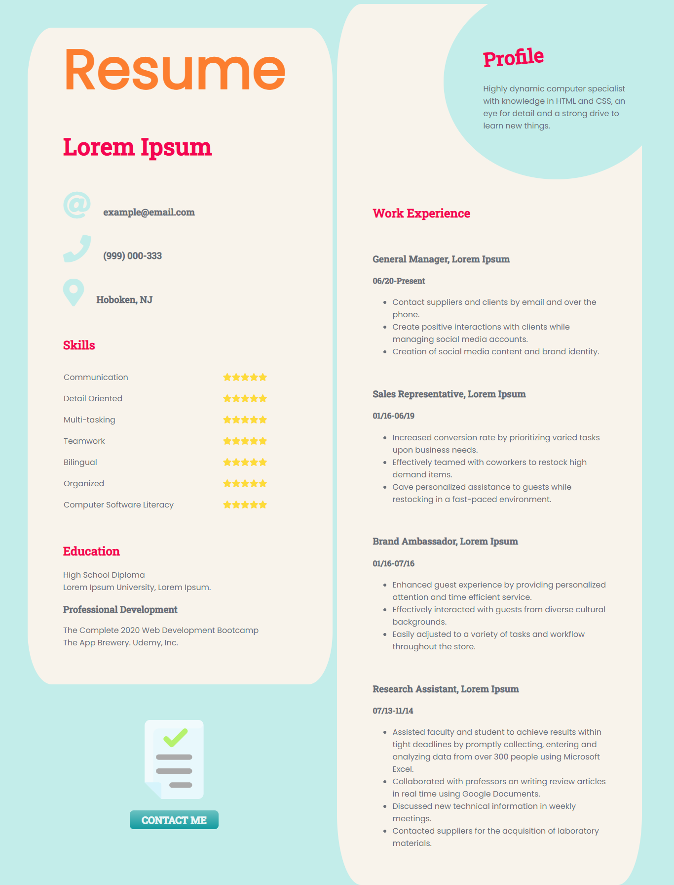
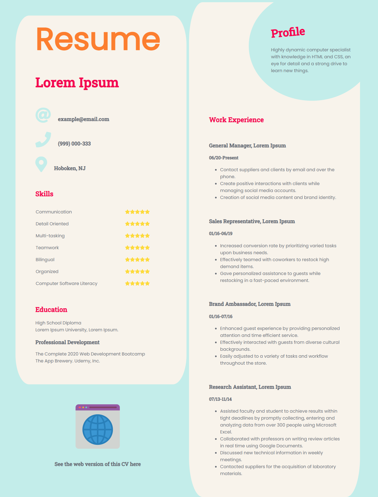

# Resume Template

Resume template coded and designed with CSS3. Pure CSS positioning was used to create the layout.
\
&nbsp;

\
&nbsp;

The page provides a link to open the default email application by clicking on the "contact me" button.

\
&nbsp;

\
&nbsp;

There is also a pdf version of the same document (see the code for this repository), which will provide a link to visit the online version of the resume.

\
&nbsp;

## Want to see it live? Visit the [resume](https://ibadra.github.io/resume/) site 💼
